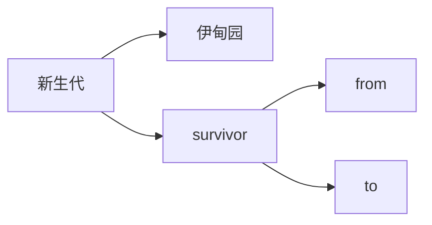

<div align="center">
    <h1>
        💾JVM八股文整理
    </h1>
</div>


## JVM 内存结构

**要求**

* 掌握 JVM 内存结构划分
* 尤其要知道方法区、永久代、元空间的关系

**结合一段 java 代码的执行理解内存划分**


* 执行 javac 命令编译源代码为字节码
* 执行 java 命令
  1. 创建 JVM，调用类加载子系统加载 class，将类的信息存入**方法区**
  2. 创建 main 线程，使用的内存区域是 **JVM 虚拟机栈**，开始执行 main 方法代码
  3. 如果遇到了**未见过的类**，会继续触发**类加载过程**，同样会存入**方法区**
  4. 需要创建对象，会使用**堆**内存来存储**对象**
  5. 不再使用的对象，会由**垃圾回收器**在内存不足时回收其内存
  6. 调用方法时，方法内的**局部变量、方法参数**所使用的是  **JVM 虚拟机栈**中的栈帧内存
  7. 调用方法时，先要到**方法区**获得到该方法的字节码指令，由**解释器**将字节码指令解释为机器码执行
  8. 调用方法时，会将要执行的指令行号读到**程序计数器**，这样当发生了线程切换，恢复时就可以从中断的位置继续
  9. 对于非 java 实现的方法调用，使用内存称为**本地方法栈**（见说明）
  10. 对于热点方法调用，或者频繁的循环代码，由 **JIT 即时编译器**将这些代码编译成机器码缓存，提高执行性能

说明

* 加粗字体代表了 JVM 虚拟机组件
* 对于 Oracle 的 Hotspot 虚拟机实现，不区分虚拟机栈和本地方法栈

### 会发生内存溢出的区域

* 不会出现内存溢出的区域 – 程序计数器

  除了程序计数器以外的区域都有可能出现内存溢出

* 出现 OutOfMemoryError 的情况

  * 堆内存耗尽 – 对象越来越多，又一直在使用，不能被垃圾回收
  * 方法区内存耗尽 – 加载的类越来越多，很多框架都会在运行期间动态产生新的类
  * 虚拟机栈累积 – 每个线程最多会占用 1 M 内存，线程个数越来越多，而又长时间运行不销毁时

* 出现 StackOverflowError 的区域

  * JVM 虚拟机栈，原因有方法递归调用未正确结束、反序列化 json 时循环引用

### 方法区、永久代、元空间

* **方法区**是 JVM 规范中定义的一块内存区域，用来存储类元数据、方法字节码、即时编译器需要的信息等

* **永久代**是 Hotspot 虚拟机对 JVM 规范的实现（1.8 之前）

* **元空间**是 Hotspot 虚拟机对 JVM 规范的另一种实现（1.8 以后），使用本地内存作为这些信息的存储空间

  下图中Heap表示堆内存 MetaSpace表示元空间


从这张图学到三点

* 当第一次用到某个类是，由类加载器将 class 文件的类元信息读入，并存储于元空间
* X，Y 的类元信息是存储于元空间中，无法直接访问
* 需要使用堆中的 X.class，Y.class 间接访问类元信息，它们俩属于 java 对象，我们的代码中可以使用


从这张图可以学到

* 堆内存中：当一个**类加载器对象**，这个类加载器对象加载的所有**类对象**，这些类对象对应的所有**实例对象**都没人引用时，GC 时就会对它们占用的对内存进行释放
* 元空间中：内存释放**以类加载器为单位**，当堆中类加载器内存释放时，对应的元空间中的类元信息也会释放


## JVM 内存参数

**要求** 

* 熟悉常见的 JVM 参数，尤其和大小相关的

**例题**


表示改虚拟机最大堆大小10G，最小堆大小10G，新生代大小5G(因此老年代大小=10G-5G=5G)，新生代分成5份，伊甸园占3份，from 和 to 各占一份(from和to的大小总是相等的)
$$
survivor=from+to=Xmn * \frac35 = 2048M
$$

### 堆内存，按大小设置


解释：

* -Xms **最小堆内存**（包括新生代和老年代）
* -Xmx **最大堆内存**（包括新生代和老年代）
* 通常建议将 -Xms 与 -Xmx 设置为大小相等，即不需要保留内存，不需要从小到大增长，这样性能较好
* -XX:NewSize 与 -XX:MaxNewSize 设置新生代的最小与最大值，但一般不建议设置，由 JVM 自己控制
* -Xmn 设置**新生代大小**，相当于同时设置了 -XX:NewSize 与 -XX:MaxNewSize 并且取值相等
* 保留是指，一开始不会占用那么多内存，随着使用内存越来越多，会逐步使用这部分保留内存。下同


### 堆内存，按比例设置


有关新生代可以做以下划分



* -XX:NewRatio=2:1 表示老年代占两份，新生代占一份
* -XX:SurvivorRatio=4:1 表示新生代分成六份，伊甸园占四份，from 和 to 各占一份


### 元空间内存设置


解释：

* class space 存储类的基本信息，最大值受 -XX:CompressedClassSpaceSize 控制
* non-class space 存储除类的基本信息以外的其它信息（如方法字节码、注解等）
* class space 和 non-class space 总大小受 -XX:MaxMetaspaceSize 控制

注意：

* 这里 -XX:CompressedClassSpaceSize 这段空间还与是否开启了指针压缩有关，这里暂不深入展开，可以简单认为指针压缩默认开启


### 代码缓存内存设置


解释：

* 如果 -XX:ReservedCodeCacheSize < 240m，所有优化机器代码不加区分存在一起
* 否则，分成三个区域（图中笔误 mthod 拼写错误，少一个 e）
  * non-nmethods - JVM 自己用的代码
  * profiled nmethods - 部分优化的机器码
  * non-profiled nmethods - 完全优化的机器码


### 线程内存设置

使用xss控制每个线程的


> ***官方参考文档***
>
> * https://docs.oracle.com/en/java/javase/11/tools/java.html#GUID-3B1CE181-CD30-4178-9602-230B800D4FAE


## JVM 垃圾回收

**要求**

* 掌握垃圾回收算法
* 掌握分代回收思想
* 理解三色标记及漏标处理
* 了解常见垃圾回收器

### 三种垃圾回收算法

#### 标记清除法


解释：

1. 找到 GC Root 对象，即那些一定不会被回收的对象，如正执行方法内局部变量引用的对象、静态变量引用的对象
2. 标记阶段：沿着 GC Root 对象的引用链找，直接或间接引用到的对象加上标记
3. 清除阶段：释放未加标记的对象占用的内存

要点：

* 标记速度与存活对象线性关系
* 清除速度与内存大小线性关系
* 缺点是会产生内存碎片


#### 标记整理法


解释：

1. 前面的标记阶段、清理阶段与标记清除法类似
2. 多了一步整理的动作，将存活对象向一端移动，可以避免内存碎片产生

特点：

* 标记速度与存活对象线性关系

* 清除与整理速度与内存大小成线性关系
* 缺点是性能上较慢


#### 标记复制法


解释：

1. 将整个内存分成两个大小相等的区域，from 和 to，其中 to 总是处于空闲，from 存储新创建的对象
2. 标记阶段与前面的算法类似
3. 在找出存活对象后，会将它们从 from 复制到 to 区域，复制的过程中自然完成了碎片整理
4. 复制完成后，交换 from 和 to 的位置即可

特点：

* 标记与复制速度与存活对象成线性关系
* 缺点是会占用成倍的空间


### GC 与分代回收算法

#### GC

GC 的目的在于实现无用对象内存自动释放，减少内存碎片、加快分配速度

GC 要点：

* 回收区域是**堆内存**，不包括虚拟机栈
* 判断无用对象，使用**可达性分析算法**，**三色标记法**标记存活对象，回收未标记对象
* GC 具体的实现称为**垃圾回收器**，有并行垃圾回收器，CMS垃圾回收器等
* GC 大都采用了**分代回收思想**
  * 理论依据是大部分对象朝生夕灭，用完立刻就可以回收，另有少部分对象会长时间存活，每次很难回收
  * 根据这两类对象的特性将回收区域分为**新生代**和**老年代**，新生代采用标记复制法、老年代一般采用标记整理法
* 根据 GC 的规模可以分成 **Minor GC**，**Mixed GC**，**Full GC**


#### 分代回收

1. 伊甸园 eden，最初对象都分配到这里，与幸存区 survivor（分成 from 和 to）合称新生代，


2. 当伊甸园内存不足，标记伊甸园与 from（现阶段没有）的存活对象


3. 将存活对象采用复制算法复制到 to 中，复制完毕后，伊甸园和 from 内存都得到释放


4. 将 from 和 to 交换位置


5. 经过一段时间后伊甸园的内存又出现不足


6. 标记伊甸园与 from（现阶段没有）的存活对象


7. 将存活对象采用复制算法复制到 to 中


8. 复制完毕后，伊甸园和 from 内存都得到释放


9. 将 from 和 to 交换位置


10. 老年代 old，当幸存区对象熬过几次回收（最多15次），晋升到老年代（幸存区内存不足或大对象会导致提前晋升）


**GC 规模**

* Minor GC 发生在新生代的垃圾回收，暂停时间短

* Mixed GC 新生代 + 老年代部分区域的垃圾回收，G1 收集器特有

* Full GC 新生代 + 老年代完整垃圾回收，暂停时间长，**应尽力避免**


#### 三色标记

即用三种颜色记录对象的标记状态

* 黑色 – 已标记
* 灰色 – 标记中
* 白色 – 还未标记


1. 起始的三个对象还未处理完成，用灰色表示


2. 该对象的引用已经处理完成，用黑色表示，黑色引用的对象变为灰色


3. 依次类推


4. 沿着引用链都标记了一遍


5. 最后为标记的白色对象，即为垃圾


##### 并发漏标问题

比较先进的垃圾回收器都支持**并发标记**，即在标记过程中，用户线程仍然能工作。但这样带来一个新的问题，如果用户线程修改了对象引用，那么就存在漏标问题。例如：

1. 如图所示标记工作尚未完成


2. 用户线程同时在工作，断开了第一层 3、4 两个对象之间的引用，这时对于正在处理 3 号对象的垃圾回收线程来讲，它会将 4 号对象当做是白色垃圾


3. 但如果其他用户线程又建立了 2、4 两个对象的引用，这时因为 2 号对象是黑色已处理对象了，因此垃圾回收线程不会察觉到这个引用关系的变化，从而产生了漏标


4. 如果用户线程让黑色对象引用了一个新增对象，一样会存在漏标问题


因此对于**并发标记**而言，必须解决漏标问题，也就是**要记录标记过程中的变化**。有两种解决方法：

1. Incremental Update **增量更新法**，CMS 垃圾回收器采用
   * 思路是拦截每次赋值动作，只要赋值发生，被赋值的对象就会被记录下来，在重新标记阶段再确认一遍
2. Snapshot At The Beginning，**SATB 原始快照法**，G1 垃圾回收器采用
   * 思路也是拦截每次赋值动作，不过记录的对象不同，也需要在重新标记阶段对这些对象二次处理
   * 新加对象会被记录
   * 被删除引用关系的对象也被记录


### 垃圾回收器


#### 补充知识：STW

##### 定义

+ STW(stop the world)指的是GC事件发生过程中，会产生应用程序的停顿。停顿产生时整个应用程序线程都会被暂停，没有任何响应, 有点像卡死的感觉，这个停顿称为STW。Java中一种全局暂停现象，全局停顿，所有Java代码停止，native代码可以执行，但不能与JVM交互；这些现象多半是由于gc引起。

  + 可达性分析算法中**枚举根节点(GC Roots)会导致所有Java执行线程停顿**。
    + 分析工作必须在一个能确保一 致性的快照中进行
    + 一致性指整个分析期间整个执行系统看起来像被冻结在某个时间点上
    + 如果出现分析过程中对象引用关系还在不断变化，则分析结果的准确性无法保证

  + 被STW中断的应用程序线程**会在完成GC之后恢复**，频繁中断会让用户感觉像是网速不快造成电影卡带一样， 所以我们需要减少STW的发生。

+ STW事件和采用哪款GC无关，所有的GC都有这个事件。

+ 哪怕是G1也不能完全避免stop-the-world情况发生，只能说垃圾回收器越来越优秀，回收效率越来越高，尽可能地缩短了暂停时间。

+ **STW是JVM在后台自动发起和自动完成的**。在用户不可见的情况下，把用户正常的工作线程全部停掉。开发中不要用System.gc() ;会导致stop-the-world的发生。
  

##### STW的原因

垃圾回收是根据可达性分析算法，搜索GC Root根的引用链，将不在引用链上的对象当做垃圾回收，设想我们执行某个方法的时候，此时产生了很多局部变量，刚好老年代满了需要进行Full GC，**如果不停止线程，垃圾回收正在根据这些局部变量也就是GC Root根搜索引用链，此时这个方法结束了，那么这些局部变量就都会被销毁，这些引用链的GC Root根都销毁了，这些引用当然也成了垃圾对象**，这样就会导致在垃圾回收的过程中还会不断的**产生新的垃圾**。

但是Stop-The-World的结果是比较严重的，如果用户正在浏览你的网站，应用程序突然Stop-The-World，所有线程被挂起，那么用户就会感觉你的网站卡住了，尽管gc时间是比较快的，但是如果并发量比较大，用户感知是比较明显的，会影响用户体验。


#### 垃圾回收器 - Parallel GC

* eden 内存不足发生 Minor GC，采用标记复制算法，需要暂停用户线程
* old 内存不足发生 Full GC，采用标记整理算法，需要暂停用户线程

* **注重吞吐量**

#### 垃圾回收器 - ConcurrentMarkSweep GC

* 它是工作在 old 老年代，支持**并发标记**的一款回收器，采用**并发清除**算法
  * 并发标记时不需暂停用户线程
  * 重新标记时仍需暂停用户线程

* 如果并发失败（即回收速度赶不上创建新对象速度），会触发 Full GC

* **注重响应时间**

#### 垃圾回收器 - G1 GC

* **响应时间与吞吐量兼顾**
* 划分成多个区域，每个区域都可以充当 eden，survivor，old， humongous，其中 humongous 专为大对象准备
* 分成三个阶段：新生代回收、并发标记、混合收集
* 如果并发失败（即回收速度赶不上创建新对象速度），会触发 Full GC


**G1 回收阶段 - 新生代回收**

1. 初始时，所有区域都处于空闲状态


2. 创建了一些对象，挑出一些空闲区域作为伊甸园区存储这些对象


3. 当伊甸园需要垃圾回收时，挑出一个空闲区域作为幸存区，用复制算法复制存活对象，需要暂停用户线程


4. 复制完成，将之前的伊甸园内存释放


5. 随着时间流逝，伊甸园的内存又有不足


6. 将伊甸园以及之前幸存区中的存活对象，采用复制算法，复制到新的幸存区，其中较老对象晋升至老年代


7. 释放伊甸园以及之前幸存区的内存


**G1 回收阶段 - 并发标记与混合收集**

1. 当老年代占用内存超过阈值(40%)后，触发并发标记，这时无需暂停用户线程


2. 并发标记之后，会有重新标记阶段解决漏标问题，此时需要暂停用户线程。这些都完成后就知道了老年代有哪些存活对象，随后进入混合收集阶段。此时不会对所有老年代区域进行回收，而是根据**暂停时间目标**优先回收价值高（存活对象少）的区域（这也是 Gabage First 名称的由来）。


3. 混合收集阶段中，参与复制的有 eden、survivor、old，下图显示了伊甸园和幸存区的存活对象复制


4. 下图显示了老年代和幸存区晋升的存活对象的复制


5. 复制完成，内存得到释放。进入下一轮的新生代回收、并发标记、混合收集


## 内存溢出

**要求**

* 能够说出几种典型的导致内存溢出的情况


### 误用线程池导致的内存溢出

* 参考 day03.TestOomThreadPool

  ```java
  // -Xmx64m
  // 模拟短信发送超时，但这时仍有大量的任务进入队列
  public static void main(String[] args) {
      ExecutorService executor = Executors.newFixedThreadPool(2);
      LoggerUtils.get().debug("begin...");
      while (true) {
          executor.submit(()->{
              try {
                  LoggerUtils.get().debug("send sms...");
                  TimeUnit.SECONDS.sleep(30);
              } catch (InterruptedException e) {
                  e.printStackTrace();
              }
          });
      }
  }
  ```

  使用了`newFixedThreadPool`,持续向该线程池中提交任务,设定堆内存为64M以快速观察内存溢出效果

  `newFixedThreadPool`的构造

  ```java
  /**
   * Creates a thread pool that reuses a fixed number of threads
   * operating off a shared unbounded queue.  At any point, at most
   * {@code nThreads} threads will be active processing tasks.
   * If additional tasks are submitted when all threads are active,
   * they will wait in the queue until a thread is available.
   * If any thread terminates due to a failure during execution
   * prior to shutdown, a new one will take its place if needed to
   * execute subsequent tasks.  The threads in the pool will exist
   * until it is explicitly {@link ExecutorService#shutdown shutdown}.
   *
   * @param nThreads the number of threads in the pool
   * @return the newly created thread pool
   * @throws IllegalArgumentException if {@code nThreads <= 0}
   */
  public static ExecutorService newFixedThreadPool(int nThreads) {
      return new ThreadPoolExecutor(nThreads, nThreads,
                                    0L, TimeUnit.MILLISECONDS,
                                    new LinkedBlockingQueue<Runnable>());
  }
  ```

  线程池中最多容纳构造函数中给出`nThreads`个线程，其余线程进入`new LinkedBlockingQueue<Runnable>()`等待执行

  `LinkedBlockingQueue`是一个最大容量为`Integer.MAX_VALUE`的队列，可以认为是无限长度的

  若同一时间进入队列的线程过多则发生内存溢出


### 查询数据量太大导致的内存溢出

* 参考 day03.TestOomTooManyObject

  使用代码如下

  ```java
  public static void main(String[] args) {
      ExecutorService executor = Executors.newCachedThreadPool();
      LoggerUtils.get().debug("begin...");
      while (true) {
          executor.submit(()->{
              try {
                  LoggerUtils.get().debug("send sms...");
                  TimeUnit.SECONDS.sleep(30);
              } catch (InterruptedException e) {
                  e.printStackTrace();
              }
          });
      }
  }
  ```

  将上一个案例中的`FixedThreadPool`更换为`CachedThreadPool`

  源码实现如下

  ```java
  /**
   * Creates a thread pool that creates new threads as needed, but
   * will reuse previously constructed threads when they are
   * available.  These pools will typically improve the performance
   * of programs that execute many short-lived asynchronous tasks.
   * Calls to {@code execute} will reuse previously constructed
   * threads if available. If no existing thread is available, a new
   * thread will be created and added to the pool. Threads that have
   * not been used for sixty seconds are terminated and removed from
   * the cache. Thus, a pool that remains idle for long enough will
   * not consume any resources. Note that pools with similar
   * properties but different details (for example, timeout parameters)
   * may be created using {@link ThreadPoolExecutor} constructors.
   *
   * @return the newly created thread pool
   */
  public static ExecutorService newCachedThreadPool() {
      return new ThreadPoolExecutor(0, Integer.MAX_VALUE,
                                    60L, TimeUnit.SECONDS,
                                    new SynchronousQueue<Runnable>());
  }
  ```

  `SynchronousQueue`可以认为是一个有限长度的队列，其中只能容纳一个任务

  第一个参数为`coreSize`，表示核心线程的数量，默认为0，即全部都是救急线程

  第二个参数为`maximumPoolSize`，表示该线程池最大容纳线程数量，此处表示救急线程数量为`Integer.MAX_VALUE`

  第三个参数为`keepAliveTime`，和后面的时间单位联系起来，表示Threads that havenot been used for sixty seconds are terminated and removed from the cache. 

  由于`maximumPoolSize`的规定，导致有大量线程堆积在线程池中时也会造成内存溢出。


### 动态生成类导致的内存溢出

* 参考 day03.TestOomTooManyClass

  参考代码如下

  ```java
  static GroovyShell shell = new GroovyShell();
  
  // -XX:MaxMetaspaceSize=24m
  // 模拟不断生成类, 但类无法卸载的情况
  public static void main(String[] args) {
      AtomicInteger c = new AtomicInteger();
      while (true) {
          try (FileReader reader = new FileReader("script")) {
  //                GroovyShell shell = new GroovyShell();
              shell.evaluate(reader);
              System.out.println(c.incrementAndGet());
          } catch (IOException e) {
              e.printStackTrace();
          }
      }
  }
  ```

  `GroovyShell`的构造函数如下

  ```java
  public class GroovyShell extends GroovyObjectSupport {
      public static final String DEFAULT_CODE_BASE = "/groovy/shell";
      private static final String[] EMPTY_STRING_ARRAY = new String[0];
      private final Binding context;
      private final AtomicInteger counter;
      private final CompilerConfiguration config;
      private final GroovyClassLoader loader;
      ...
  }
  ```

  `GroovyClassLoader`用于加载执行脚本时动态生成的类。

  由于`GroovyShell`被定义为一个根对象，无法被GC，因此这些被产生的无法被释放，会堆满元始代，导致内存溢出。

  要避免这种情况只要在`try`内定义`GroovyShell`即可。


## 类加载

**要求**

* 掌握类加载阶段
* 掌握类加载器
* 理解双亲委派机制


### 类加载过程的三个阶段

1. 加载

   1. 将类的字节码载入方法区，并创建类.class 对象

   2. 如果此类的父类没有加载，先加载父类

   3. 加载是懒惰执行

      ```java
      /**
       * 此案例说明
       <ul>
          <li>类加载是懒惰的, 首次用到时才加载（下面的初始化条件满足也会导致类加载）
            <ol>
               <li>使用了类.class</li>
               <li>用类加载器的 loadClass 方法加载类</li>
            </ol>
          </li>
          <li>类初始化是懒惰的, 满足条件有
            <ol>
               <li>main 方法所在类</li>
               <li>首次访问静态方法或静态变量(非 final, 或 final的 引用类型)</li>
               <li>子类初始化, 导致的父类初始化</li>
               <li>Class.forName(类名, true, loader) 或 Class.forName(类名)</li>
               <li>new, clone, 反序列化时</li>
            </ol>
          </li>
       </ul>
      
       */
      public class TestLazy {
          private Class<?> studentClass;
          public static void main(String[] args) throws IOException {
              System.out.println("未用到 Student");
              System.in.read();
      
              System.out.println(Student.class);   // 关键代码1，会触发类加载
              System.out.println("已加载 Student");
              TestLazy testLazy = new TestLazy();
              testLazy.studentClass = Student.class;
              System.in.read();
      
              Student stu = new Student();        // 关键代码2，会触发类初始化
              System.out.println("已初始化 Student");
              System.in.read();
          }
      }
      ```

2. 链接
   1. 验证 – 验证类是否符合 Class 规范，合法性、安全性检查
   2. 准备 – 为 static 变量分配空间，设置默认值
   3. 解析 – 将常量池的符号引用解析为直接引用

3. 初始化
   1. 静态代码块、static 修饰的变量赋值、static final 修饰的引用类型变量赋值，会被合并成一个 `<cinit>` 方法，在初始化时被调用
   2. static final 修饰的基本类型变量赋值，在链接阶段就已完成。在代码中引用final的基本类型变量不会引发类的加载。
   3. 初始化是懒惰执行

> ***验证手段***
>
> * 使用 jps 查看进程号
> * 使用 jhsdb 调试，执行命令 `jhsdb.exe hsdb` 打开它的图形界面
>   * Class Browser 可以查看当前 jvm 中加载了哪些类
>   * 控制台的 universe 命令查看堆内存范围
>   * 控制台的 g1regiondetails 命令查看 region 详情
>   * `scanoops 起始地址 结束地址 对象类型` 可以根据类型查找某个区间内的对象地址
>   * 控制台的 `inspect 地址` 指令能够查看这个地址对应的对象详情
> * 使用 javap 命令可以查看 class 字节码


**jdk 8 的类加载器**

| **名称**                | **加载哪的类**        | **说明**                       |
| ----------------------- | --------------------- | ------------------------------ |
| Bootstrap ClassLoader   | JAVA_HOME/jre/lib     | 无法直接访问                   |
| Extension ClassLoader   | JAVA_HOME/jre/lib/ext | 上级为 Bootstrap，显示为  null |
| Application ClassLoader | classpath             | 上级为 Extension               |
| 自定义类加载器          | 自定义                | 上级为 Application             |


### 双亲委派机制

所谓的双亲委派，就是指优先委派上级类加载器进行加载，如果上级类加载器

* 能找到这个类，由上级加载，加载后该类也对下级加载器可见
* 找不到这个类，则下级类加载器才有资格执行加载

双亲委派的目的有两点

1. 让上级类加载器中的类对下级共享（反之不行），即能让你的类能依赖到 jdk 提供的核心类

2. 让类的加载有优先次序，保证核心类优先加载


**对双亲委派的误解**

下面面试题的回答是错误的


错在哪了？

* 自己编写类加载器就能加载一个假冒的 java.lang.System 吗? 答案是不行。

* 假设你自己的类加载器用双亲委派，那么优先由启动类加载器加载真正的 java.lang.System，自然不会加载假冒的

* 假设你自己的类加载器不用双亲委派，那么你的类加载器加载假冒的 java.lang.System 时，它需要先加载父类 java.lang.Object，而你没有用委派，找不到 java.lang.Object 所以加载会失败

* **以上也仅仅是假设**。事实上操作你就会发现，自定义类加载器加载以 java. 打头的类时，会抛安全异常(JNI ERROR)，在 jdk9 以上版本这些特殊包名都与模块进行了绑定，更连编译都过不了


>***代码说明***
>
>* day03.loader.TestJdk9ClassLoader - 演示类加载器与模块的绑定关系


## 反射

### 用途

在理解反射原理前，我们应该知道它的作用，在此之后，去了解它的原理才会有意义。

反射功能通常用于检查或修改Java虚拟机运行中（runtime）的应用程序的行为，这一句话就精准的描述了反射的全部功能，更详细来说可以分为以下几点：

1. 在运行中分析类的能力，可以通过完全限定类名创建类的对象实例。

2. 在运行中查看和操作对象，可以遍历类的成员变量。
3. 反射允许代码执行非反射代码中非法的操作，可以检索和访问类的私有成员变量，包括私有属性、方法等。

注意：要有选择的使用反射功能，如果可以直接执行操作，那么最好不要使用反射。


### 原理

在一个方法中，如果我们不知道在实际运行（runtime）时，它将要处理的对象是谁，它的类型信息是怎么样的，那我们如何访问这个对象或为这个对象创建一个新的实例呢？其实这个访问或创建新实例的操作就是反射了。

参考上面的jvm模型，反射首先需要获取到**这个对象存放在方法区的类型信息**，获取到类型信息后，我们就知道这个类的**构造器、属性、方法、注解、子类、父类**等等信息了，这个时候，我们就可以通过这些类型信息来回调处理对象，来完成自己想要的操作了。

没错，这就是反射的原理了。反射在运行时，**通过读取方法区中的字节码，来动态的找到其反射的类以及类的方法和属性等**（实际上就是在运行时，根据全类型名在方法区找对应的类），用这些类型信息完成对该类实例的操作，其实就是直接使用类的一个逆向使用。

```java
void reflectMethod(Object obj) {
        // 处理这个无法明确类型的实例对象
 
        // 获取类型信息
        Class<?> aClass = obj.getClass();
        Field[] fields = aClass.getFields();
        Method[] methods = aClass.getMethods();
        Annotation[] annotations = aClass.getAnnotations();
        Constructor<?>[] constructors = aClass.getConstructors();
        Class<?>[] interfaces = aClass.getInterfaces();
        // ...
        // 操作属性或方法
        Field field = fields[0];
        Object o = field.get(obj); // 获取obj的属性值
}
```

反射是运行时先拿到对象，根据对象得到方法区中的类型信息后，再操作该对象。


### 反射的缺点

1. 额外的性能开销（Performance Overhead）：由于反射涉及动态类型的解析，它无法执行某些Java虚拟机优化，因此反射操作的性能通常要比非反射操作慢。

2. 安全限制（Security Restrictions）：反射需要运行时操作权限，此操作可能在一些安全管理器下不被允许。

3. 内部泄露（Exposure of Internals）：由于反射允许代码执行非反射代码中非法的操作（例如访问私有字段和方法），因此使用反射可能会导致意外的副作用，这可能会使代码无法正常工作并可能破坏可移植性。反射性代码破坏了抽象，因此可能会随着平台的升级而改变行为。


### 使用方法

+ Object.getClass()

  从一个实例对象中获取它的类。这仅适用于继承自Object的引用类型（当然Java的类默认继承于Object）。

+ XXX.class

  直接从未实例化的类获取类。

+ Class.forName()

  通过完全限定类名获取类。即包名加类名（java.util.HashMap）。否则会报找不到类错误。

+ Integer.TYPE(已弃用)

+ 通过反射类ClassAPI获取类

  ```java
  try {
    Class<?> className = Class.forName("java.lang.String");
    // 获取父类
    Class<?> superclass = className.getSuperclass();
    // 返回调用类的成员变量，包括所有公共的类、接口和枚举
    Class<?>[] classes = className.getClasses();
    // 返回调用类的依赖，包括所有类、接口和显式声明的枚举
    Class<?>[] declaredClasses = className.getDeclaredClasses();
  } catch (ClassNotFoundException e) {
    e.printStackTrace();
  }
  ```

  

## 四种引用

**要求**

* 掌握四种引用


### 强引用

1. 普通变量赋值即为强引用，如 A a = new A();

2. 通过 GC Root 的引用链，如果强引用不到该对象，该对象才能被回收


### 软引用（SoftReference）

1. 例如：SoftReference a = new SoftReference(new A());

2. 如果仅有软引用该对象时，**首次垃圾回收不会回收该对象，如果内存仍不足，再次回收时才会释放对象**

3. 软引用自身需要配合引用队列来释放

4. 典型例子是反射数据，反射数据都是软引用的


### 弱引用（WeakReference）

1. 例如：WeakReference a = new WeakReference(new A());

2. 如果仅有弱引用引用该对象时，**只要发生垃圾回收，就会释放该对象**

3. 弱引用自身需要配合引用队列来释放

4. 典型例子是 ThreadLocalMap 中的 Entry 对象


### 虚引用（PhantomReference）

1. 例如： PhantomReference a = new PhantomReference(new A(), referenceQueue);

2. 必须配合**引用队列**一起使用，当虚引用所引用的对象被回收时，由 **Reference Handler 线程将虚引用对象入队**，这样就可以知道哪些对象被回收，从而对它们关联的资源做进一步处理

3. 典型例子是 Cleaner 释放 DirectByteBuffer 关联的直接内存


```java
public class TestPhantomReference {
    public static void main(String[] args) throws IOException, InterruptedException {
        ReferenceQueue<String> queue = new ReferenceQueue<>();// 引用队列
        List<MyResource> list = new ArrayList<>();
        list.add(new MyResource(new String("a"), queue));
        // 此处"b"不使用new String，则会在字符串池中存储一份"b"，此处为其强引用，不会被回收
        list.add(new MyResource("b", queue)); 
        list.add(new MyResource(new String("c"), queue));

        System.gc(); // 垃圾回收
        Thread.sleep(100);
        Object ref;
        while ((ref = queue.poll()) != null) {
            if (ref instanceof MyResource resource) {
                resource.clean();
            }
        }
    }

    static class MyResource extends PhantomReference<String> {
        public MyResource(String referent, ReferenceQueue<? super String> q) {
            super(referent, q);
        }
        // 释放外部资源的方法
        public void clean() {
            LoggerUtils.get().debug("clean");
        }
    }
}
```


### 补充：`cleaner`

```java
// 前面讲的弱、虚引用配合引用队列，目的都是为了找到哪些 java 对象被回收，从而进行对它们关联的资源进行进一步清理
// 为了简化 api 难度，从 java 9 开始引入了 Cleaner 对象
public class TestCleaner1 {
    public static void main(String[] args) throws IOException {
        Cleaner cleaner = Cleaner.create();

        // register(资源,清理动作)
        cleaner.register(new MyResource(), ()-> LoggerUtils.get().debug("clean 1"));
        cleaner.register(new MyResource(), ()-> LoggerUtils.get().debug("clean 2"));
        cleaner.register(new MyResource(), ()-> LoggerUtils.get().debug("clean 3"));
        MyResource obj = new MyResource(); // 对象不能被回收则清理动作不执行
        cleaner.register(obj, ()-> LoggerUtils.get().debug("clean 4"));
        cleaner.register(new MyResource(), ()-> LoggerUtils.get().debug("clean 5"));
        cleaner.register(new MyResource(), ()-> LoggerUtils.get().debug("clean 6"));

        System.gc();
        System.in.read();
    }

    static class MyResource {

    }
}
```


## finalize

**要求**

* 掌握 finalize 的工作原理与缺点


**finalize**

* 它是 Object 中的一个方法，如果子类重写它，垃圾回收时此方法会被调用，可以在其中进行资源释放和清理工作
* 将资源释放和清理放在 finalize 方法中非常不好，非常影响性能，严重时甚至会引起 OOM(内存溢出)，从 Java9 开始就被标注为 @Deprecated，不建议被使用了


### finalize 原理

```java
public class TestFinalize {
	static class Dog {
        private String name;

        public Dog(String name) {
            this.name = name;
        }

        @Override
        protected void finalize() throws Throwable {
            LoggerUtils.get().debug("{}被干掉了?", this.name);
            int i = 1 / 0;
        }
    }

    public static void main(String[] args) throws IOException {
        new Dog("大傻");
        new Dog("二哈");
        new Dog("三笨");
        System.gc();
        System.in.read();
    }
}
```

输出

```
[DEBUG] 19:04:28.094 [Finalizer] - 三笨被干掉了? 
[DEBUG] 19:04:28.098 [Finalizer] - 二哈被干掉了? 
[DEBUG] 19:04:28.098 [Finalizer] - 大傻被干掉了? 
```

**说明**

> 第一，从表面上我们能看出来 finalize 方法的调用次序并不能保证
> 第二，日志中的 Finalizer 表示输出日志的线程名称，从这我们看出是这个叫做 Finalizer 的线程调用的 finalize 方法
> 第三，你不能注释掉 `System.in.read()`，否则会发现（绝大概率）并不会有任何输出结果了，从这我们看出 finalize 中的代码并不能保证被执行
> 第四，如果 finalize 中的代码出现异常，会发现根本没有异常输出
> 第五，还有个疑问，垃圾回收时就会立刻调用  finalize 方法吗？——不会 对象会先被加入RefrenceQueue中，由一个线程逐个取出执行finalize方法。


1. 对 finalize 方法进行处理的核心逻辑位于 java.lang.ref.Finalizer 类中，它包含了名为 unfinalized 的静态变量（双向链表结构），Finalizer 也可被视为另一种引用对象（地位与软、弱、虚相当，只是不对外，无法直接使用）
2. 当重写了 finalize 方法的对象，在构造方法调用之时，JVM 都会将其包装成一个 Finalizer 对象，并加入 unfinalized 链表中


3. Finalizer 类中还有另一个重要的静态变量，即 ReferenceQueue 引用队列，刚开始它是空的。当狗对象可以被当作垃圾回收时，就会把这些狗对象对应的 Finalizer 对象加入此引用队列
4. 但此时 Dog 对象还没法被立刻回收，因为 unfinalized -> Finalizer 这一引用链还在引用它嘛，为的是【先别着急回收啊，等我调完 finalize 方法，再回收】
5. FinalizerThread 线程会从 ReferenceQueue 中逐一取出每个 Finalizer 对象，把它们从链表断开并真正调用 finallize 方法


6. 由于整个 Finalizer 对象已经从 unfinalized 链表中断开，这样没谁能引用到它和狗对象，所以下次 gc 时就被回收了


### finalize 缺点

+ 代码执行本身问题

  * 无法保证资源释放：FinalizerThread 是守护线程，代码很有可能没来得及执行完，线程就结束了

  * 无法判断是否发生错误：执行 finalize 方法时，会吞掉任意异常（Throwable），无法判断是否在释放资源时发生错误

+ 影响性能

  * 内存释放不及时：重写了 finalize 方法的对象在第一次被 gc 时，并不能及时释放它占用的内存，因为要等着 FinalizerThread 调用完 finalize，把它从 unfinalized 队列移除后，第二次 gc 时才能真正释放内存

  * GC本身因为内存不足引起，finalize调用又因为涉及到两个队列串行的移除操作而非常缓慢，不能及时释放内存，对象释放不及时就会逐步移入老年代，老年代垃圾堆积过多就容易引起fullGC， fullGC后释放速度若仍然跟不上创建新对象的速度，就会发生OOM(Out of Memory)

+ 质疑

  * 有的文章提到【Finalizer 线程会和我们的主线程进行竞争，不过由于它的优先级较低，获取到的CPU时间较少，因此它永远也赶不上主线程的步伐】这个显然是错误的，FinalizerThread 的优先级较普通线程更高，原因应该是 finalize 串行执行慢等原因综合导致
